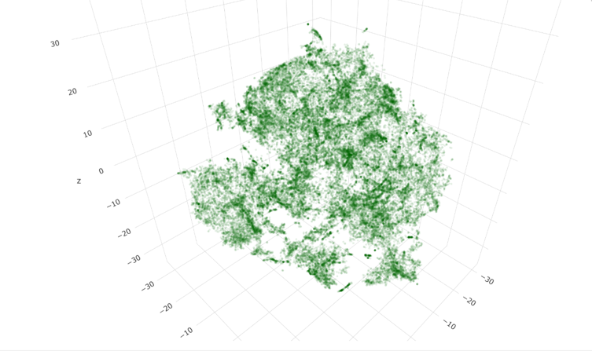

# Neural Subreddit Recommender

**Source:**
[Neural Collaborative Filtering](https://github.com/hexiangnan/neural_collaborative_filtering)



This repository hosts the subreddit recommender system I built by using neural network embeddings. I recreated a simplified version of the neural network outlined in the paper <a href="https://arxiv.org/pdf/1708.05031.pdf">"Neural Collaborative Filtering"</a>, authored by Xiangnan He in 2017. The paper proposes one of the first deep learning architectures modelled for collaborative filtering.
It managed to outperform many of the popular collaborative filtering methods at the time. Other advances have been done in deep recommender systems since then, but I chose this paper, because it was straightforward and easy to apply to my own dataset.

The dataset consisted of Reddit comments from over 30000 users, which I collected myself using the Reddit's PRAW API. After cleaning and preparing, the dataset was comprised of over 1 million user submissions across 54926 unique subreddits. After model training, I ended up with a 40-dimensional embedding vector for each subreddit. Similarity between subreddits is calculated using the cosine similarity of their embeddings. Here's a [link](https://github.com/ejyap/neural_subreddit_recommender/blob/master/notebooks/collaborative_filtering.ipynb) to the notebook where I trained the neural network. You can find the preprocessed dataset, as well as the embeddings, [here](https://github.com/ejyap/neural_subreddit_recommender/tree/master/data). I also wrote a short summary of the paper, which can be found [here]("https://github.com/ejyap/neural_subreddit_recommender/blob/master/notebooks/paper_summary.ipynb).

While the system does a decent job, there are some limitations. First of all, I only used the hyperparameters suggested by the paper. A better performance could be achieved with better hyper parameters, but each training session on the dataset takes about 8 hours. I could've also gotten a better performance if I trained it for longer, but the results were already good enough. Another limitation is the size of my dataset. I only sampled 30000 users, which leads to a lack of comments from less active subreddits. The neural network has no option but to overfit the few users who comment in a particular subreddit, leading to bad recommendations. One final limitation is the model's training time. It took 8 hours to train the model on my dataset, but imagine having to training it on millions of users or having to constantly re-train to reflect present user activities. It's just too resource consuming. The good thing is that it's not common to have new active subreddits every month. Also, the current subreddits won't shift in popularity too much, so I can expect my model to remain relevant for a while, even without updates.

Despite the limitations, I enjoyed building this project because it allowed me to learn a lot about neural networks, recommender systems and Python web programming. I also got to learn about frameworks such as Keras and Flask. In the future, I hope to improve the application by implementing real-time online learning and by using a better neural network architecture.

To generate your own subreddit recommendations:

```python
from app import recommender, utils

embeddings = utils.load_npy('data/embeddings.npy')
[d, inv_d] = utils.load_json('data/subreddit_dicts.json')

recommendations = recommender.get_recs_for_subreddit('Python', embeddings, d, inv_d, num_recommendations=10)
```


